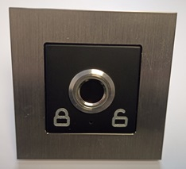
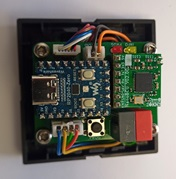
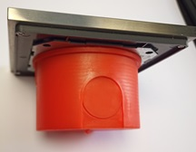

# OAM-Fingerprint

OpenKNX Firmware und Anwendung zur OpenKNX-kompatiblen Einbindung von Fingerabdrucklesern.

## Kompatible Fingerabdruckleser

Aktuell werden folgende Fingerabdruckleser unterstützt:
- GROW R503 (Speicherkapazität: 200 Finger)
- GROW R503S (Speicherkapazität: 150 Finger)
- GROW R503Pro (Speicherkapazität: 1500 Finger)
- Adafruit R503 (identisch zu GROW R503)

Weitere Fingerabdruckleser können bei Bedarf angebunden werden.

## Kompatible Hardware

Die kompakte Steuerplatine kann vollständig in ein Standard-Schalterprogramm integriert werden. Hier als Beispiel mit Gira-Schalterprogramm in matt schwarz und Edelstahlrahmen:

<kbd></kbd>
<kbd></kbd>

Bei Bedarf können zwei zusätzliche Touch-Buttons links/rechts unten im Gira-Rahmen verbaut werden, welche z. B. zum Schließen/Öffnen einer Tür verwendet werden können. In der Mitte zwischen den beiden Touch-Buttons kann hinter einer kleinen Öffnung noch eine rot/grüne LED zur Anzeige des Status verbaut werden.

Dabei ist lediglich eine Einbautiefe von ca. 2 cm in einer Standard-60-mm-Unterputzdose erforderlich:

<kbd></kbd>

Bei Interesse an der Hardware bitte Kontakt über [E-Mail](mailto:info@ab-smarthouse.com?subject=[OpenKNX]%20Fingerprint) aufnehmen.